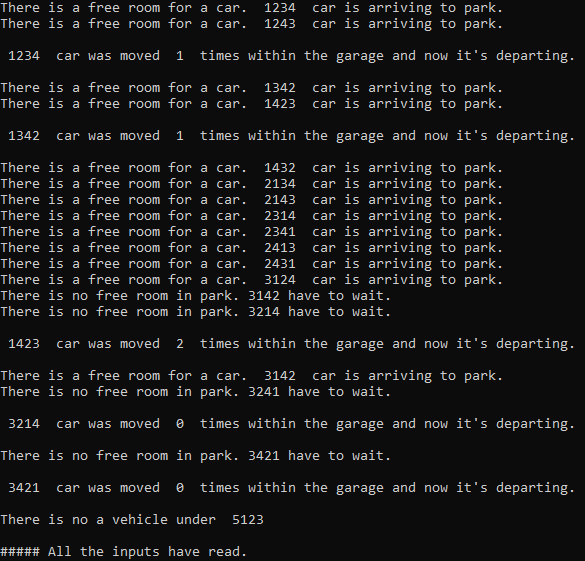

# Python Car-Park

A demo project of a car park system that designed using python(3) language. Based on a **Queue** implementation.

- This park contains a single lane that hold up to ten cars.
- Cars arrive at the south-end of the park and leave from the north-end.
- If a customer arrives to pick up a car that that is not nothernmost, all the cars to the north of his car are moved out, his car is driven out, and the others cars are restored in the same order that they were in originally.
- Whenever a car leaves, all the cars to the south are moved forward.
- So that all the times all the empty spaces are in the south part of the park.

## Application Execution

